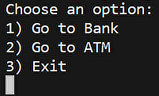
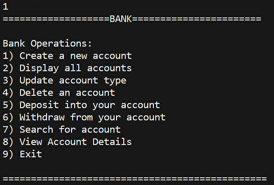
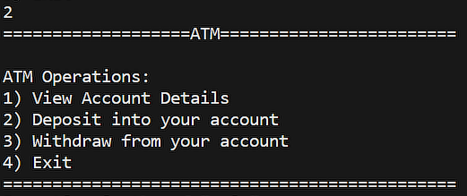
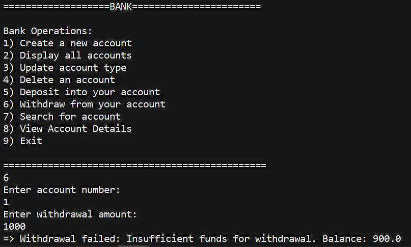

# Bank Management System

This repository contains a Java implementation of a bank management system. The system is designed using object-oriented principles, incorporating **inheritance** and the **factory design pattern** for modularity and extensibility.

## Features

- **Account Management**: Allows users to create, update, delete, and view bank accounts.
- **Deposit and Withdrawal**: Provides functionalities to deposit and withdraw funds from accounts.
- **Account Type Conversion**: Supports converting account types between Savings, Current, and Salary.
- **ATM Operations**: Includes operations for viewing account details, depositing, and withdrawing funds.

## Object-Oriented Design

The program is structured around the following classes:

- **Bank**: Manages bank accounts and provides operations for account management.
- **Account**: Represents a bank account and provides functionalities for depositing and withdrawing funds.
- **SavingsAccount**, **CurrentAccount**, **SalaryAccount**: Subclasses of Account representing specific account types.

## Inheritance

Inheritance is utilized to create specialized account types (Savings, Current, Salary) that inherit common functionalities from the base Account class. This promotes code reuse and enables easy extension of account functionalities in the future.

## Factory Design Pattern

The **factory design pattern** is employed in the AccountFactory class, responsible for creating instances of specific account types based on user input. This pattern centralizes object creation logic, making the code more maintainable and scalable.

## Usage
might require JDK17 as coded in ***JDK17***

Download Folder, Run ***App.java*** inside bank_management/src Folder

## Visual

  <h3>Initial View Here choose Bank or ATM</h3>
  

  <h3>Bank allows the following operations</h3>
  

  <h3>ATM allows the following operations</h3>
  

  <h3>Error Handing using Exceptions</h3>
  

